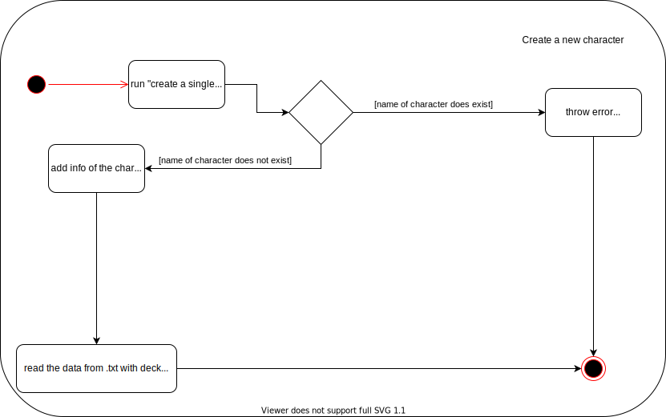

**Проект для курса "Технологии программирования". Игра "MIPTSTONE"**
==========
!!!!!!!!!!!!!!!!!!!
ВНИМАНИЕ: Игра находится в разработке, возможны баги
---
!!!!!!!!!!!!!!!!!!!
Описание и правила игры
----------

Карточная игра на 2 человек.

Работает по принципу HearthStone: В начале каждого кона игрокам выдается фиксированное количество БРС и новые карты. 
Каждая карта стоит определенное количество БРС и имеет характеристики(об этом в отдельном пункте).
Игрок может выложить карту на стол, отдав на неё БРС.
Каждый кон любая карты, выложенная на стол, может атаковать либо карты соперника, либо самого соперника.
После завершения хода, ходит соперник. Кон состоит из одного хода с каждой стороны.

Архитектура создания объектов
--------

Добавление путем дописания преподавателей в prepods.txt
...to be continued

--------

Установка
--------

cd MIPTSTONE

./INSTALL.sh

Запуск
--------

cd MIPTSTONE

./RUN.sh

GUI
-------

Карты:
 
Каждая карта имеет характеристики: Знания, Общение, Умение преподавать, Халявность.
 На основе этих характеристик формируются новые характеристики, назовем их основными.
 Именно основные характеристики влияют на возможности карты. 
Основные характеристики: Сила, хп. На основе основных характеристик формируется стоимость карты(в БРС).
 [Также у каждой карты есть особая уникальная способность].

Интерфейс: (ссылка на HS)

Меню:
 Начать новую игру.
 Посмотреть все существующие карты.
 Добавить новую карту.
 Изменить описание уже существующей карты.